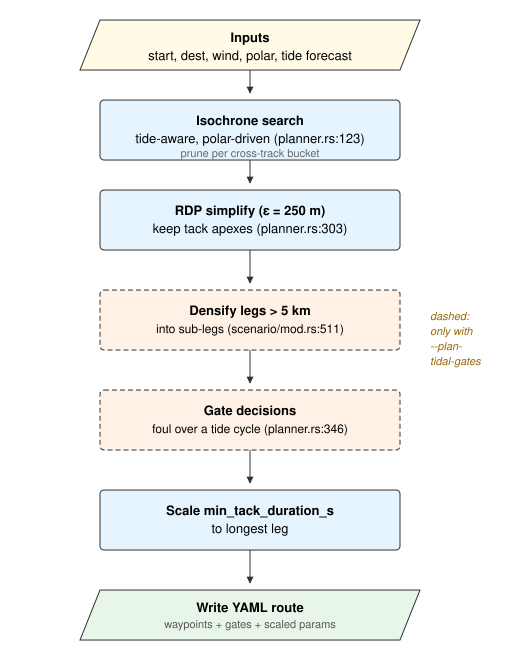
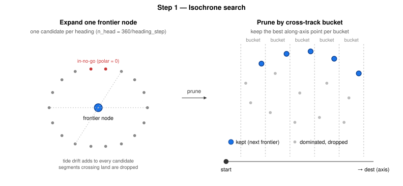
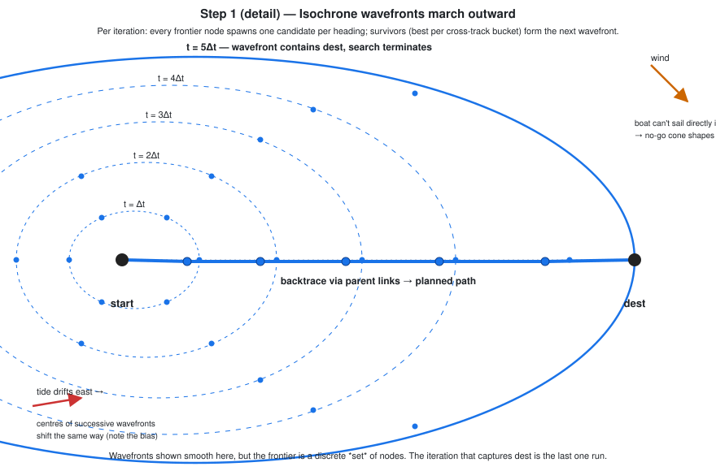
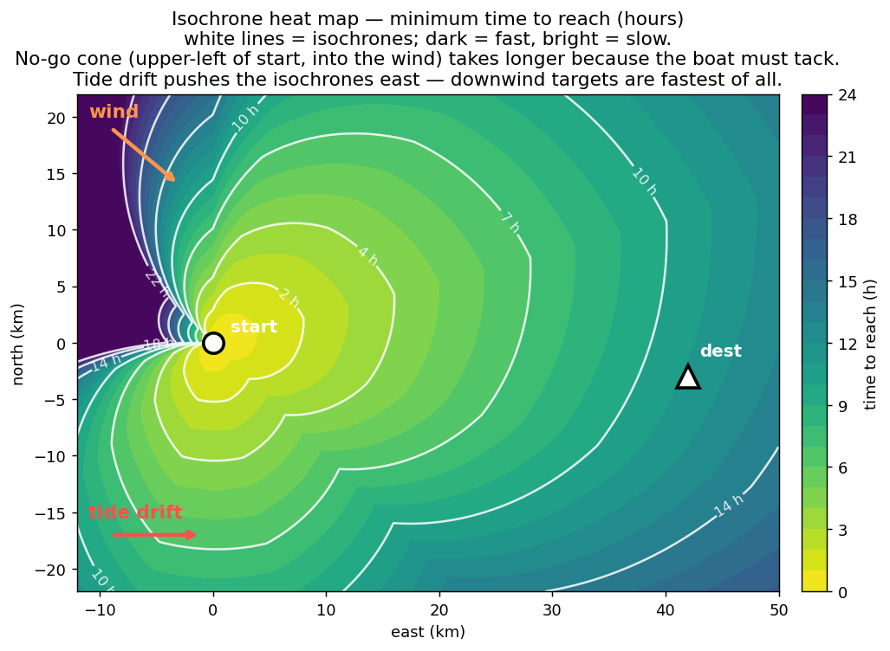
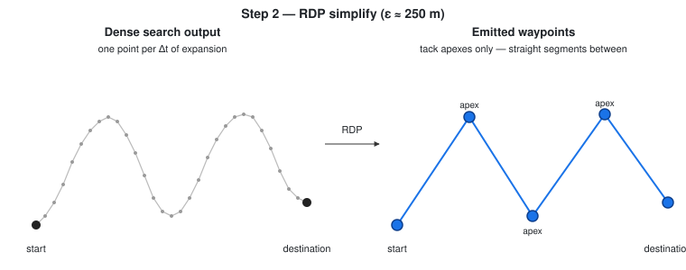
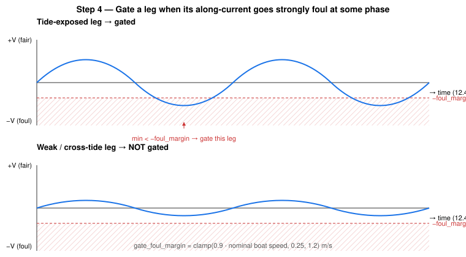
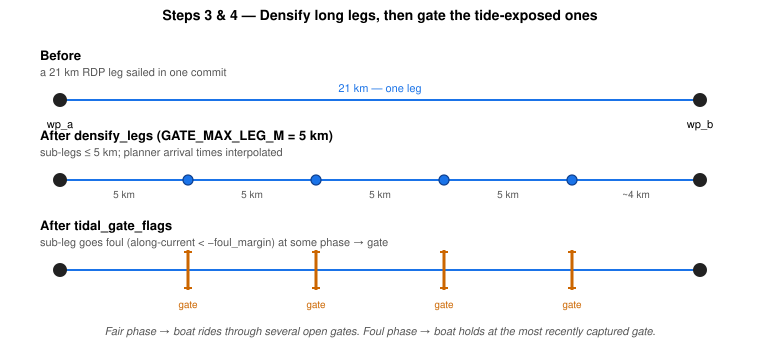
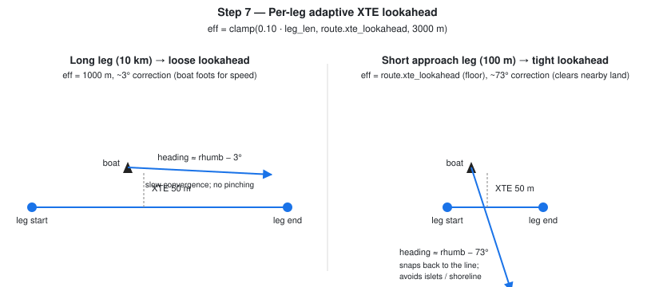
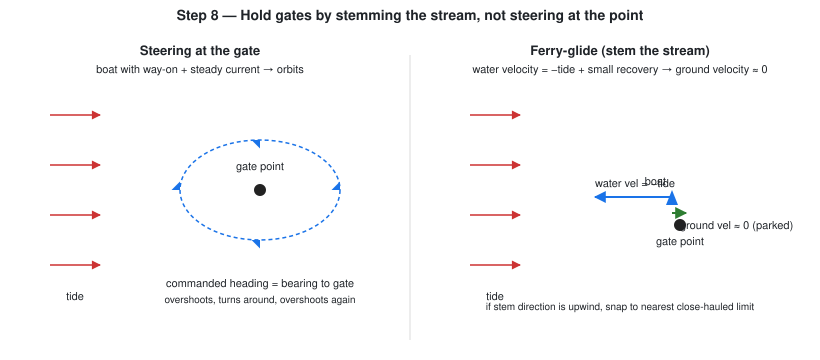
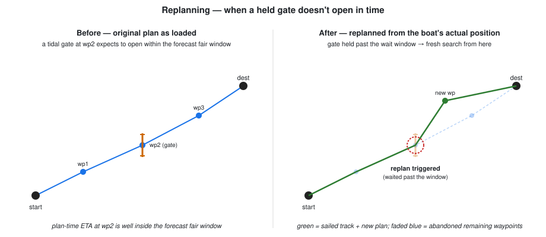

# Route planning

You tell the planner where you're starting, where you want to go, the wind,
and the tide forecast. It hands you back a route: a sequence of waypoints
to sail, plus a few rules for what to do at each one. The follower (the
autopilot's route-tracking brain) then steers the boat through it,
adapting as the real conditions diverge from the forecast.

This doc explains the logic — what the planner does, why, and how it
trades things off — without the source-code spelunking.

## What you give and what you get

**In:** the start and destination, a wind direction and speed, a tide
forecast (or none, for still water), an optional chart of the coastline,
and a *polar* — a curve of the boat's speed as a function of the angle
between its heading and the wind. Optionally: `--plan-tidal-gates` to
ask for holds where the tide would stop you.

**Out:** a YAML route file. The first waypoint is the start, the last is
the destination, and the ones between trace the path. Some waypoints
may be flagged as gates (the boat will park there until the tide turns
fair on the next leg). The file also records the rules the follower
should sail under: how aggressively to track the rhumb line, how long
to commit to a tack, and when held gates should open.

The boat is sailed by the follower at run-time. The plan is a recipe
the follower works from, not a script it slavishly obeys: when the
actual wind or tide diverges from the forecast, the follower adapts
locally.

## The pipeline at a glance

Each step below explains the logic, not the code.

## Finding the path: isochrone search

The planner asks "where could the boat have reached after Δt?", then
"after 2Δt?", and so on, until "could it have reached the destination?"
Each wave outward in time is an **isochrone**: the set of all points the
boat could be in after exactly that amount of planner-time.

To grow the frontier by one Δt, every point on it tries every possible
heading. Most candidates fail one of three checks: directly upwind the
polar gives zero speed (the no-go cone), some segments would run the
boat onto rocks (land avoidance), and many survivors are *dominated* —
beaten by another candidate that ended up at the same lateral position
but further along the route. The dominated ones are dropped per
cross-track *bucket*: in each thin slice perpendicular to the
start-to-destination line, only the candidate furthest along the line
survives. This is the trick that keeps the frontier from exploding
combinatorially as time advances.

Tide enters naturally. When a candidate is expanded at planner-time t,
the forecast is queried at t too — so a candidate reached later in the
planning sees a later tide phase, the same one the boat will actually
meet at that point in the passage.

Over many iterations the frontier marches outward as a sequence of
wavefronts. The shape is not a perfect circle: the upwind cone is
indented (the boat can't sail directly upwind), and the centres drift
in the direction the tide is setting. When some wavefront lands close
enough to the destination, the search stops. Every node remembers the
parent it came from, so a walk back through parents reconstructs the
path.

Another way to look at the same thing: pretend you painted every point in
the surrounding sea with the minimum time it'd take the boat to get
there. You'd get a heat map. Dark = fast (downwind, with the tide); bright
= slow (upwind, where the boat has to tack); the wedge into the wind is
the no-go cone, and the whole map leans in the direction the tide is
setting. The isochrones (the wavefronts above) are just the
constant-time contour lines of this heat map.

## Cleaning up the path: tack apexes only

The raw search puts a point every Δt — far too many to feed the
follower as waypoints, and most of them lie on top of the zigzag tacks.
The planner thins them with Ramer-Douglas-Peucker: keep only the
corners (the tack apexes), drop anything that sits near-straight
between two kept neighbours. Each kept segment becomes a clean tack the
follower can steer directly, with no extra wandering between.

## Tidal gates: hold position when the tide will actually stop you

Two separate decisions.

**Which legs need a gate?** Without a forecast, none. With one, the
planner samples the tide on each leg over a full cycle (~12 hours) and
checks whether the along-leg current ever goes strongly foul. "Strongly
foul" is scaled to the boat's own speed — roughly 90% of it: a weak
foul that the boat can plow through doesn't earn a hold, because a
boat moving forward at half speed beats a boat parked at zero. A leg
whose current is always near zero (cross-tide), or always fair, never
gets gated.

**Are any legs too long for one fair-tide window?** A 20 km leg sailed
in one shot can have the tide turn against you halfway through, setting
you back further than the fair stretch had carried you. So long legs
get split into roughly 5 km sub-legs, with a gate between each — short
enough that during a fair phase the boat rides through several of them
in sequence, and only holds at whichever one the tide turns under.

When a leg is gated, the boat arrives at that waypoint, parks (more on
parking below), waits for the next leg's tide to come fair, and then
proceeds.

Two regime boundaries are worth knowing — both validated by sailing
the same route under different tides:

- **Weak foul** (foul current weaker than boat speed): no gates are
  emitted. The boat sails straight through — faster than holding.
- **Strong foul** (foul stronger than boat speed): gates fire and pay
  off. Holding beats getting pushed backward.

## Long tacks on long legs

Same idea applied to tacking. When the route is essentially upwind and
the boat has to zigzag, the planner sets a **minimum tack duration**
scaled to the leg length. A 30-second minimum on a 36 km close-hauled
fetch makes the boat flip-flop tacks at the no-go boundary every time
the tide nudges the bearing across 45° — the crossing never finishes.
A 30-minute minimum (set automatically for a leg that long) commits the
boat to one or two long tacks, which keeps boat speed up because the
boat isn't constantly slowing through the wind. Short maneuvering
routes keep their original snappy tacking — the scaling kicks in only
when there's a long leg to merit it.

## How the boat steers the plan: per-leg cross-track tracking

When the boat finds itself off the straight line between two waypoints
— pushed by tide, knocked by a gust — the follower commands a course
that brings it back. *How aggressively* depends on how long the current
leg is:

- On a long open leg (10 km, say), being 50 m off track is nothing —
  the boat can drift back gently while still pointing essentially at
  the destination. A sharp "claw back now!" command would make a
  close-hauled boat point too high, lose drive, and stall.
- On a short approach leg (a few hundred metres), 50 m off is half the
  leg — the boat must correct hard, or it'll cut the corner and (in
  the Lundy approach) plow straight through the island.

So the follower scales its correction angle to the leg's length:
gentle on long legs, sharp on short ones. The route file just sets a
floor (the minimum lookahead it'll ever use); the follower opens it up
per-leg where appropriate.

## Crabbing into the tide (opt-in)

Tracking the line and *not getting set sideways in the first place* are
different things. With `--crab` enabled, when the follower is steering
directly at the next waypoint (not tacking, not holding at a gate), it
offsets the commanded heading by a *crab angle* so the boat's
through-water motion plus the tidal set lands the ground track on the
rhumb line. Geometrically: aim slightly upstream of where you want to
go, so the tide carries you sideways onto your line.

It's deliberately off by default. The crab angle is a kinematic
solution that doesn't know about the polar — on a marginally powered
boat in a strong cross-set, demanding more crab puts the heading too
close to the wind, which slows the boat, which makes the apparent crab
angle even larger. The follower's cross-track-error term already keeps
moderate set in check over time, so crab is the right call mostly when
the cross-set is large compared to boat speed and you'd rather pay the
upwind cost than let it wash you off track. Crab is also skipped
during gate holds, since the ferry-glide heading is already a
water-frame command and applying crab on top would double-compensate.

## Holding station: ferry-glide, don't orbit

At a held gate the obvious thing is to "steer at the waypoint." This
doesn't work. A boat with way-on in a current can't sit still: it
overshoots the point, the helm turns it around to come back, it
overshoots the other way, and the hold becomes a slow orbit around the
gate — drifting unpredictably and burning hours that should have been
spent waiting calmly.

The fix is borrowed from cruising practice: **ferry-glide**. Point the
boat into the current with just enough through-water speed to cancel
the drift. Its ground velocity is then near zero — it actually parks.
A small bias back toward the waypoint corrects for any slow leftover
drift. If the upstream direction happens to be straight into the wind
(so the boat can't sail it), the heading snaps to the nearest sailable
angle, which keeps the boat moving — and therefore steerable — while
losing as little ground as possible.

## Replanning when the forecast turns out wrong (opt-in)

A gate is a bet that the tide will behave as the forecast said. If the
forecast is right, the gate opens when expected and the boat continues.
If the forecast is wrong — the foul phase ran longer than predicted, or
the boat got to the gate hours later than planned because of a slow leg
earlier — the gate just sits there, ferry-gliding, waiting for a fair
window that never comes.

Enable `--replan-on-gate` and the autopilot stops waiting after
`--replan-after-wait-s` seconds (default an hour). It tears up the
unsailed portion of the plan and runs a fresh isochrone search from
the boat's *current* position, with the *current* time and tide phase.
The new path replaces the abandoned waypoints; the boat just keeps
sailing, now following the new plan.

The new plan typically looks different from the original because the
search starts from a different place and a different tide phase: it
may need no gate, a different gate, or a different tack pattern.
What it always has in common with the original is the destination.

Replanning isn't free — the planner measures the boat's polar up front
when this is first enabled (a handful of short sims), and each replan
runs the same isochrone search the original plan did. So it's opt-in:
useful for long passages where forecast drift is plausible, overkill
for short hops.

## What the planner doesn't do

- **It plans space, not time.** It doesn't pick your departure hour.
  To start a passage at the slack-water turn, make your first waypoint
  a gate: the follower will hold at the start, ferry-gliding, until
  the first leg's tide is fair.
- **It uses a polar, not a full physics sim.** The polar is a
  steady-state speed model; in gusts and through tacks the boat's
  actual speed will differ.
- **It samples one tide cycle for gate decisions.** It doesn't reason
  about spring vs. neap, or stack multi-day forecasts.
- **It doesn't replan on its own.** Replanning is opt-in (see the
  section above); without it, a stale gate will hold the boat until
  the tide eventually does turn fair.
- **It doesn't model wave-making, leeway, or sail trim limits beyond
  the polar.** Those are the follower's and the simulator's job.

## Levers you can tune

User-facing knobs (CLI flags or route-file fields):

| Lever | What it does |
|---|---|
| `--polar-derate` | Scales the planner's speed model. Lower = more conservative ETAs and longer detours to avoid foul tide. |
| `--plan-tidal-gates` | Turn gate placement on or off entirely. |
| `--crab` | Aim slightly into the tide so the ground track stays on the rhumb line (off by default; see "Crabbing into the tide" above). |
| `--replan-on-gate` | Allow the autopilot to re-run the planner from the boat's current position if a held gate doesn't open within `--replan-after-wait-s`. |
| `--replan-after-wait-s` | How long a gate is allowed to hold past its expected window before the replan fires. |
| `xte_lookahead` (route) | The floor for the follower's line-tracking aggressiveness. The follower opens it up per-leg but never tightens below this. |
| `min_tack_duration_s` (route) | The floor for how long the boat commits to a tack. The planner raises it on long legs. |
| `gate_open_along_current` (route) | How fair the tide must be before a held gate opens. |
| `gate_min_fair_window_s` (route) | How long that fair tide must be expected to last. |
